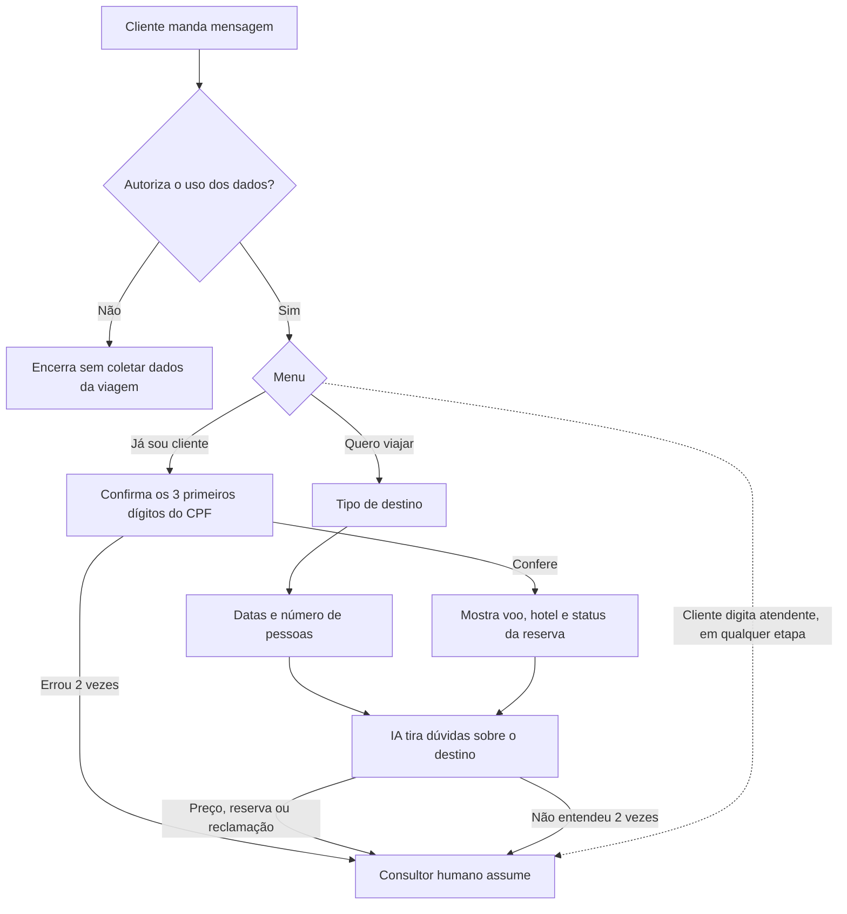
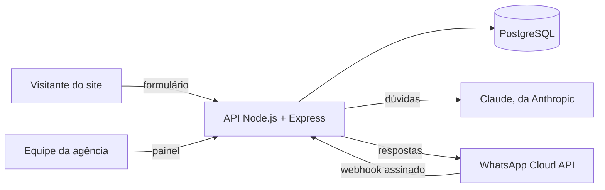

# Rota Viva — site de agência de viagens com atendimento no WhatsApp

Site de captação de clientes para agência de viagens, integrado a um agente de atendimento no WhatsApp que tira dúvidas com IA e passa a conversa para um consultor humano quando precisa. Inclui um painel onde a agência acompanha os pedidos de cotação e as conversas.

> **Rota Viva Viagens** é o nome usado na demonstração. Marca, textos, destinos e preços do site são exemplos — veja [Antes de lançar](#antes-de-lançar).

**Situação atual:** publicado em modo demonstração. O atendimento roda numa simulação do WhatsApp no navegador; a ligação com o WhatsApp de verdade está pronta no código e depende só das credenciais da Meta ([como ligar](#ligando-o-whatsapp-de-verdade)).

## Demonstração online

| O quê | Endereço |
|---|---|
| Site | https://rota-viva-demo.onrender.com |
| Atendimento (simulação do WhatsApp) | https://rota-viva-demo.onrender.com/demo |
| Painel de dados | https://rota-viva-demo.onrender.com/admin — exige usuário e senha |

Hospedado no plano gratuito do Render: depois de 15 minutos sem visitas o serviço hiberna, e o primeiro acesso seguinte leva cerca de 1 minuto.

---

## O que o sistema faz

### Site

- **Carrossel de destinos** em formato de cartão de embarque, com código do aeroporto, melhor época e tarifa de referência.
- **Formulário de cotação dinâmico**: os campos mudam conforme o tipo de destino — regime de hospedagem para praia, carro para campo, passaporte e seguro para exterior.
- **Calculadora de orçamento** que atualiza a estimativa enquanto a pessoa preenche datas e número de viajantes.
- **LGPD**: banner de cookies com opção de recusar, e autorização de contato por WhatsApp que começa desmarcada.

### Agente de atendimento no WhatsApp



- Nunca é um beco sem saída: a palavra "atendente" transfere para um humano em qualquer ponto, e a IA também transfere quando não entende duas vezes seguidas.
- A IA não inventa preços, disponibilidade nem dados de reserva — esses assuntos vão direto para o consultor.
- Dados de reserva só aparecem depois da confirmação do CPF, e o número do WhatsApp precisa bater com o da reserva.
- Com um consultor na conversa, o robô fica em silêncio. Depois de 24 horas sem mensagens, a conversa volta para o robô.

### Painel da agência (`/admin`)

- **Leads do site**: pedidos de cotação com busca, filtro por destino e exportação para Excel (CSV).
- **Conversas do WhatsApp**: em que etapa cada cliente está, quem está atendendo (robô ou consultor), destino, datas e a última dúvida.
- Duas contas, as duas só de leitura: a da agência e a de quem está avaliando o sistema. O acesso de uma pode ser cortado sem afetar a outra.

### Modo demonstração (`/demo`)

Uma tela que imita o WhatsApp e conversa com o **mesmo motor** que atende os clientes reais. Tem roteiros prontos para apresentar (pedido de cotação, consulta de reserva, pergunta de preço, pedido de atendente, recusa de consentimento) e um painel lateral que mostra a etapa do fluxo, o que o sistema guardou e os avisos que a equipe receberia.

Nenhuma mensagem sai para o WhatsApp, e a tela só aceita telefones fictícios (prefixo `55000`), então nunca toca em dados de clientes reais. Sem chave da Anthropic, as dúvidas são respondidas por um banco de respostas prontas em [`api/src/whatsapp/ai-demo.js`](api/src/whatsapp/ai-demo.js).

---

## Arquitetura



A API também serve o site, então tudo fica num endereço só.

| Parte | Tecnologia |
|---|---|
| Site | HTML, CSS e JavaScript puro |
| API | Node.js 20+ com Express 5 |
| Banco | PostgreSQL 16 (Docker no computador, Render na nuvem) |
| Validação | Zod |
| Segurança HTTP | Helmet e express-rate-limit |
| IA | Claude (`claude-opus-5`) pelo SDK oficial da Anthropic |
| WhatsApp | WhatsApp Business Platform — API oficial da Meta |
| Hospedagem | Render, configurado por [`render.yaml`](render.yaml) |

### Estrutura de pastas

```
├── web/                     # site
│   ├── index.html
│   ├── styles.css
│   └── app.js               # carrossel, formulário dinâmico, calculadora, cookies
├── api/
│   ├── db/
│   │   ├── schema.sql       # tabelas leads e conversas
│   │   ├── 002_reservas.sql # tabela de reservas (ramo "Já sou cliente")
│   │   └── migrar.js        # cria as tabelas que faltarem
│   ├── src/
│   │   ├── server.js        # monta as rotas, segurança e o site
│   │   ├── db.js            # conexão com o PostgreSQL
│   │   ├── security.js      # reCAPTCHA e limpeza de entradas
│   │   ├── painel.html      # painel da agência
│   │   ├── demo.html        # tela de demonstração
│   │   ├── routes/
│   │   │   ├── cotacao.js   # formulário do site
│   │   │   ├── admin.js     # painel: login, leads, conversas
│   │   │   └── demo.js      # demonstração
│   │   └── whatsapp/
│   │       ├── webhook.js   # recebe mensagens da Meta e valida a assinatura
│   │       ├── flow.js      # o fluxo de atendimento
│   │       ├── send.js      # envia mensagens pela API da Meta
│   │       ├── ai.js        # respostas com Claude
│   │       ├── ai-demo.js   # respostas prontas da demonstração
│   │       └── caixa.js     # saída de mensagens do modo demonstração
│   └── .env.example         # modelo das variáveis de ambiente
├── docker-compose.yml       # PostgreSQL local
└── render.yaml              # hospedagem no Render
```

---

## Rodando no seu computador

**Você precisa de:** [Node.js](https://nodejs.org) 20 ou mais recente e [Docker Desktop](https://www.docker.com/products/docker-desktop) aberto.

1. Suba o banco. Ele fica acessível só neste computador, na porta 5433:

   ```bash
   docker compose up -d
   ```

2. Instale as dependências:

   ```bash
   cd api
   npm install
   ```

3. Crie o seu `.env` a partir do modelo (PowerShell: `Copy-Item .env.example .env`):

   ```bash
   cp .env.example .env
   ```

   Para rodar a demonstração, preencha no mínimo:

   ```
   MODO_DEMO=1
   RECAPTCHA_DESATIVADO=1
   ADMIN_USER=seu-usuario
   ADMIN_PASS=uma-senha-forte
   ```

   Para gerar uma senha forte: `node -e "console.log(require('crypto').randomBytes(12).toString('base64url'))"`

4. Crie as tabelas e suba a API:

   ```bash
   npm run migrar
   npm run dev
   ```

5. Abra:
   - http://localhost:3000 — site
   - http://localhost:3000/demo — atendimento
   - http://localhost:3000/admin — painel

O `npm run dev` reinicia a API sozinho a cada arquivo salvo. Para ver os dados direto no banco: host `localhost`, porta `5433`, banco `agencia`, usuário `postgres`, senha `senha_local`.

### Variáveis de ambiente

Todas estão descritas em [`api/.env.example`](api/.env.example). O `.env` com os valores reais nunca vai para o Git.

| Variável | Para quê |
|---|---|
| `DATABASE_URL` | Endereço do PostgreSQL |
| `PORT` | Porta da API (padrão 3000) |
| `TRUST_PROXY` | Quantos proxies há na frente da API. Vazio no computador; `3` no Render |
| `RECAPTCHA_SECRET` | Chave secreta do reCAPTCHA v3 |
| `RECAPTCHA_DESATIVADO` | `1` desliga o reCAPTCHA — só para testes |
| `ADMIN_USER` / `ADMIN_PASS` | Conta da agência no painel |
| `CLIENTE_USER` / `CLIENTE_PASS` | Conta de avaliação no painel (opcional) |
| `WHATSAPP_TOKEN` / `WHATSAPP_PHONE_ID` | Credenciais da API do WhatsApp |
| `WA_VERIFY_TOKEN` | Frase que você inventa para a Meta confirmar o webhook |
| `WA_APP_SECRET` | Chave secreta do app da Meta — valida cada mensagem recebida |
| `WA_API_VERSION` | Versão da API da Meta (padrão `v23.0`) |
| `ANTHROPIC_API_KEY` | Chave da Anthropic para a IA. Sem ela, dúvidas vão para um consultor |
| `MODO_DEMO` | `1` liga a demonstração e impede o envio de mensagens reais |

### Rotas da API

| Rota | O que faz | Proteção |
|---|---|---|
| `GET /` | Site | Política de conteúdo (CSP) |
| `POST /api/cotacao` | Recebe e grava o pedido de cotação | Validação, reCAPTCHA, 5 envios por minuto por visitante |
| `GET /webhook` | Confirmação do webhook pela Meta | Token de verificação |
| `POST /webhook` | Mensagens do WhatsApp | Assinatura HMAC-SHA256; eventos repetidos são descartados |
| `/demo` | Demonstração | Só existe com `MODO_DEMO=1`; só aceita telefones fictícios |
| `/admin` | Painel e seus dados | Usuário e senha; só leitura |
| `GET /saude` | Checagem de funcionamento usada pelo Render | — |

---

## Segurança

- **Transporte:** HTTPS obrigatório (HSTS) e política de conteúdo (CSP) em todas as páginas; o servidor não revela a tecnologia usada.
- **Entradas:** tudo é validado e limpo no servidor; as consultas ao banco são parametrizadas, o que impede injeção de SQL. O painel e a demonstração exibem os dados sem interpretá-los como HTML, o que impede XSS.
- **Limite de uso:** 5 pedidos de cotação por minuto por visitante. O IP só é lido do cabeçalho do proxy quando `TRUST_PROXY` diz que há proxy na frente — sem isso, qualquer um forjaria o próprio IP.
- **WhatsApp:** cada mensagem recebida precisa vir assinada com a chave do app da Meta, verificada em tempo constante. Mensagens do mesmo cliente são processadas em ordem, uma de cada vez.
- **Reservas:** só aparecem para o número dono da reserva e depois dos 3 primeiros dígitos do CPF. Duas falhas bloqueiam a consulta por 24 horas e chamam um consultor.
- **Falha segura:** sem chave do reCAPTCHA, o formulário é recusado — desligá-lo exige pedir explicitamente. Erros não devolvem detalhes internos. A API se recusa a iniciar com a demonstração e o WhatsApp real ligados ao mesmo tempo.
- **Banco:** no computador, só aceita conexões locais; no Render, não aceita nenhuma conexão de fora — só a API fala com ele.
- **IA:** não tem acesso a ferramentas nem a dados de clientes, e é instruída a ignorar mensagens que tentem mudar as regras dela.

## LGPD

- A autorização de contato no site começa desmarcada e fica gravada com data, hora e IP.
- O banner de cookies oferece recusar com o mesmo destaque de aceitar.
- No WhatsApp, o robô pede autorização antes de perguntar qualquer coisa sobre a viagem. Se a pessoa recusa, ele não coleta mais nada; ficam registrados só o número e a própria recusa.
- Do CPF, o sistema só pede e só conhece os 3 primeiros dígitos — nunca o número completo.
- **Pendente:** um jeito de apagar os dados de um cliente que peça (art. 18 da LGPD).

---

## Publicação no Render

O [`render.yaml`](render.yaml) cria tudo de uma vez: a API (que também serve o site) e um PostgreSQL sem acesso externo.

1. No [Render](https://render.com), entre com o GitHub e dê acesso a este repositório.
2. **New → Blueprint**, escolha o repositório e o branch `main`, e aplique.
3. As senhas do painel (`ADMIN_PASS` e `CLIENTE_PASS`) são geradas pelo Render — veja em **Environment**, no serviço `rota-viva-demo`.

Cada merge no `main` publica uma nova versão automaticamente. As tabelas são criadas ou atualizadas sozinhas antes de a API subir (`npm start`).

**Limites do plano gratuito:** o serviço hiberna depois de 15 minutos sem visitas, e o banco gratuito expira 30 dias depois de criado. Para uso real, o banco precisa de um plano pago.

## Ligando o WhatsApp de verdade

1. Crie um app em [developers.facebook.com](https://developers.facebook.com), adicione o produto **WhatsApp** e anote `WHATSAPP_PHONE_ID`, `WHATSAPP_TOKEN` e a chave secreta do app (`WA_APP_SECRET`). Invente uma frase para `WA_VERIFY_TOKEN`.
2. Preencha essas variáveis e **apague `MODO_DEMO`** — a API não inicia com os dois ligados.
3. No painel da Meta, cadastre o webhook `https://SEU-ENDERECO/webhook` com a mesma frase de `WA_VERIFY_TOKEN` e assine o campo `messages`.
4. Troque o token temporário, que expira em 24 horas, por um permanente, criado por um usuário do sistema no Gerenciador de Negócios da Meta.
5. Opcional: preencha `ANTHROPIC_API_KEY` para a IA responder dúvidas. Sem ela, o fluxo funciona igual, e as dúvidas livres vão direto para um consultor.

Para testar o webhook no seu computador antes de publicar, exponha a porta 3000 com o [ngrok](https://ngrok.com) (`ngrok http 3000`) e use o endereço gerado no passo 3.

## Antes de lançar

Itens de demonstração que precisam ser trocados pelos dados reais da agência:

- [x] Nome e marca "Rota Viva Viagens" — site (`web/index.html`), mensagens do robô (`api/src/whatsapp/flow.js`), instrução da IA (`api/src/whatsapp/ai.js`), painel (`api/src/painel.html`, `api/src/routes/admin.js`) e demonstração (`api/src/demo.html`)
- [x] Número do botão "Falar no WhatsApp" (`5511999999999`) — `web/index.html`
- [x] Número do CADASTUR, cidade e e-mail do encarregado de dados — rodapé de `web/index.html`
- [x] Telefone para quem recusa o consentimento (`(11) 4000-0000`) — `api/src/whatsapp/flow.js`
- [x] Destinos, preços do carrossel e valores da calculadora (`BASE_DIARIA`) — `web/index.html` e `web/app.js`
- [x] Chave do reCAPTCHA (`SUA_SITE_KEY`) — `web/index.html` e `web/app.js`; depois, apagar `RECAPTCHA_DESATIVADO`
- [x] Banco em plano pago no Render

## Próximos passos

- Avisar a equipe por e-mail ou Slack quando chega uma cotação ou um cliente pede atendente — hoje o aviso vai só para o log (há um `TODO` em `flow.js`).
- Botão de exclusão de dados no painel, para atender pedidos da LGPD.
- Histórico completo das mensagens de cada conversa no painel.
- Testes automatizados do fluxo de atendimento.

## Licença

Projeto privado. Todos os direitos reservados.
